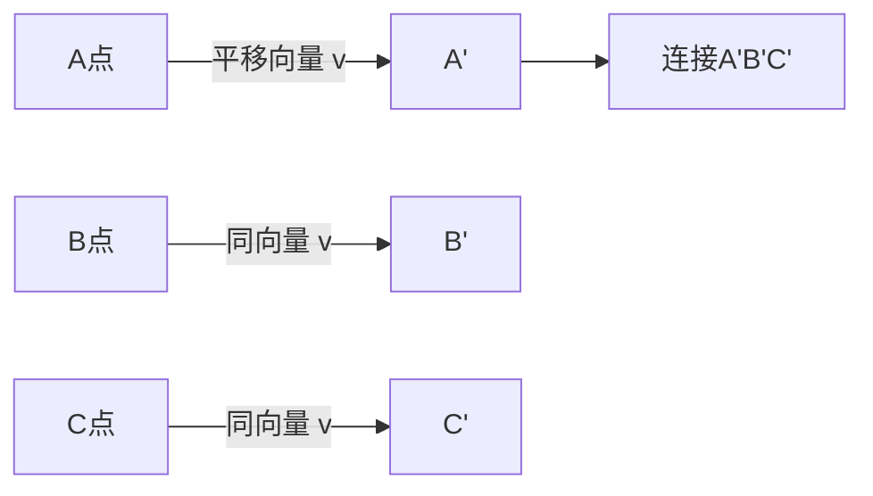

---
{"dg-publish":true,"permalink":"/02////","tags":["数学/代数/函数"]}
---

以下是关于**图形平移**的核心概念、性质与解题方法的系统总结，结合几何直观与坐标变换，帮助您全面掌握这一基础变换：

---

### 一、平移的定义与本质

1. ​**基本概念**​：  
    在平面内，将图形沿**指定方向**移动**固定距离**，图形中所有点按相同方向移动相同距离。
2. ​**核心特性**​：
    - ​**形状大小不变**​：平移是**刚体变换**，不改变图形形状、大小和方向。
    - ​**全等性**​：平移前后图形全等（对应点、对应边、对应角均相等）。
    - ​**路径一致性**​：图形上任意两点连线与平移后对应连线**平行且相等**。

---

### 二、平移的数学描述（坐标系中）

#### 1. ​**平移向量**​

定义平移的**方向**和**距离**，记为向量 $\overrightarrow{v} = (a, b)$：

- $a$：水平移动距离（右正左负）
- $b$：竖直移动距离（上正下负）

#### 2. ​**坐标变换公式**​

点 $(x, y)$ 平移后坐标：

$$
(x', y') = (x + a, y + b)
$$

​**示例**​：将点 $A(2, 3)$ 按向量 $\overrightarrow{v} = (4, -1)$ 平移：

$$
A'(2+4, 3+(-1)) = (6, 2)
$$

---

### 三、平移的作图步骤（尺规作图）

1. ​**确定平移向量**​：给定方向与距离（如“向右5格，向下3格” → $\overrightarrow{v} = (5, -3)$）。
2. ​**标记关键点**​：在图形上选取顶点（如三角形的三个顶点）。
3. ​**平移关键点**​：沿平移向量移动每个点，标出对应点位置。
4. ​**连接新图形**​：按原图形顺序连接平移后的点。

​**示例**​：平移三角形 $ABC$（如图）：

---

### 四、平移的应用场景

#### 1. ​**几何证明与构造**​

- ​**转移线段**​：通过平移将分散线段集中构造特殊图形（如平行四边形）。  
    ​**例**​：证明 $AB + CD = EF$ → 平移 $CD$ 至 $C'D'$ 与 $AB$ 共线。
- ​**化归问题**​：将不规则图形平移拼合为规则图形求面积。

#### 2. ​**实际应用**​

|​**领域**​|​**应用案例**​|
|---|---|
|​**工程设计**​|机械零件位置调整（传送带运动）|
|​**计算机图形**​|游戏角色移动、UI元素动态效果|
|​**建筑移位**​|历史建筑整体平移保护（实物平移）|

#### 3. ​**函数图像平移**​

- 函数 $y = f(x)$ 的图像平移：
    - 向右平移 $h$ 单位 → $y = f(x - h)$
    - 向上平移 $k$ 单位 → $y = f(x) + k$  
        ​**示例**​：$y = x^2$ 向右移 2 单位 → $y = (x-2)^2$。

---

### 五、常见题型与解题方法

#### ​**题型 1：找平移后的坐标**​

​**问题**​：将点 $P(-1, 4)$ 向左平移 3 单位，再向下平移 2 单位，求新坐标。  
​**解**​：

- 平移向量 $\overrightarrow{v} = (-3, -2)$
- $P'(-1 + (-3), 4 + (-2)) = (-4, 2)$

#### ​**题型 2：确定平移向量**​

​**问题**​：图形从位置 A 平移到位置 B，已知点 $A(1,2)$ 对应 $A'(4,-1)$，求平移向量。  
​**解**​：

$$
\overrightarrow{v} = (4-1, -1-2) = (3, -3)
$$

#### ​**题型 3：平移构造几何关系**​

​**问题**​：如图，平移线段 $AD$ 使点 $A$ 与点 $C$ 重合，证明 $AB \parallel CD$。  
​**思路**​：

1. 平移 $AD$ 至 $CE$（$A→C$，$D→E$）。
2. 证明四边形 $BCED$ 为平行四边形 → $AB \parallel CE \parallel CD$。

---

### ⚠️ 六、易错点与避坑指南

|​**易错点**​|​**正确做法**​|
|---|---|
|​**混淆平移与旋转**​|平移不改变方向；旋转改变方向|
|​**忽略向量方向**​|向左平移：$a$ 为负；向下平移：$b$ 为负|
|​**连接顺序错误**​|平移后需按原图形顶点顺序连接|

---

### 💡 七、解题口诀

> ​**平移三要素：方向、距离、一致性；**​  
> ​**坐标变换口诀：横加纵加，向量定乾坤；**​  
> ​**全等不变是根本，平行等长保图形！​**​

---

​**综合练习**​：  
矩形 $ABCD$ 顶点坐标 $A(1,1), B(4,1), C(4,3), D(1,3)$，按向量 $\overrightarrow{v} = (2, -3)$ 平移：

1. 求平移后顶点坐标；
2. 判断新矩形与原矩形的关系。  
    ​**答案**​：
3. $A'(3,-2), B'(6,-2), C'(6,0), D'(3,0)$；
4. 全等（大小形状相同），对应边平行且相等。

​**关键**​：平移的本质是**整体移动**，通过向量控制位移，保持图形内在关系不变。掌握坐标变换公式与作图步骤，即可解决几何证明与函数变换问题！