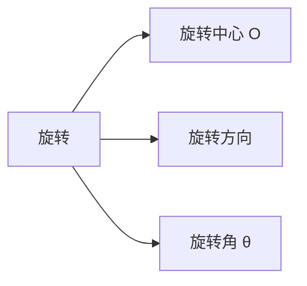
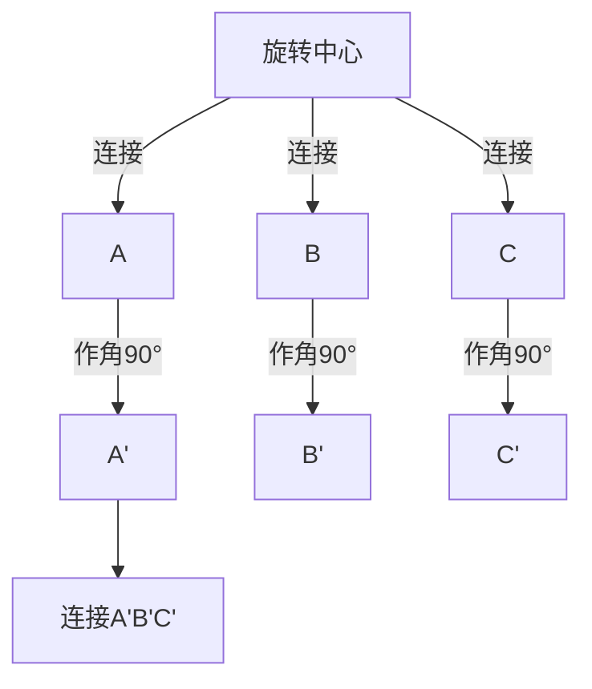

---
{"dg-publish":true,"permalink":"/02////","tags":["数学/代数/函数","数学/几何"]}
---

以下是关于**图形旋转**的核心概念、性质与解题方法的系统总结，涵盖数学定义、坐标变换、作图技巧及实际应用：

---

### 一、旋转的定义与要素

1. ​**基本概念**​：  
    在平面内，将图形绕一个**定点**​（旋转中心）按某个**方向**​（顺时针/逆时针）转动一个**角度**​（旋转角）的变换。
2. ​**核心要素**​：
    - ​**旋转中心**​（$O$）：固定不动的点（如钟表的轴心）。
    - ​**旋转方向**​：顺时针（CW）或逆时针（CCW）。
    - ​**旋转角**​（$\theta$：转动的角度（如 $90^\circ, 180^\circ$）。

---

### 二、旋转的性质（保变分析）

|​**性质**​|​**描述**​|​**示例**​|
|---|---|---|
|​**保形性**​|旋转后图形**全等**​（形状大小不变）|△ABC 旋转后 ≌ △A'B'C'|
|​**保距性**​|对应点到旋转中心距离**相等**​|OA = OA', OB = OB'|
|​**保角性**​|任意对应线段夹角等于**旋转角**​|∠AOA' = θ|
|​**对称性**​|旋转中心是唯一不动点|点 O 位置不变|

---

### 三、旋转的坐标变换（直角坐标系）

设旋转中心为原点 $O(0,0)$，点 $P(x,y)$ 逆时针旋转 $\theta$ 后得到 $P'(x',y')$：

$$
\begin{cases}
x' = x \cos \theta - y \sin \theta \\
y' = x \sin \theta + y \cos \theta
\end{cases}
$$

​**示例**​：点 $A(2,0)$ 绕原点逆时针转 $90^\circ$：

$$
x' = 2 \cos 90^\circ - 0 \sin 90^\circ = 0 \\
y' = 2 \sin 90^\circ + 0 \cos 90^\circ = 2 \quad \rightarrow A'(0,2)
$$

> ​**注**​：若旋转中心非原点，先平移坐标系使中心到原点，旋转后再移回。

---

### 四、旋转作图的步骤（尺规作图）

1. ​**确定三要素**​：旋转中心 $O$、方向（CCW/CW）、角度 $\theta$。
2. ​**连接关键点**​：将图形顶点与 $O$ 连线（如 $OA, OB$）。
3. ​**作旋转角**​：
    - 以 $O$ 为顶点，$OA$ 为一边作角 $\theta$（方向按需求）。
4. ​**截取等距**​：在角的另一边上截取 $OA' = OA$，得对应点 $A'$。
5. ​**连接新图形**​：按顺序连接所有新顶点（如 $A'B'C'$）。

​**示例**​：旋转三角形 $ABC$（逆时针 $90^\circ$）：

---

### 五、旋转的应用场景

#### 1. ​**几何证明与构造**​

- ​**构造等边/等腰三角形**​：通过旋转转移线段（如将 $AB$ 绕 $A$ 转 $60^\circ$ 得等边三角形）。
- ​**证明线段相等/垂直**​：  
    ​**例**​：如图，旋转 △APC 使 $AC$ 与 $AB$ 重合，证明 $PC = PB$ 且 $PC \perp PB$。

#### 2. ​**实际应用**​

|​**领域**​|​**应用案例**​|
|---|---|
|​**机械工程**​|齿轮传动（旋转角度计算转速比）|
|​**计算机图形**​|3D模型旋转（游戏角色视角变换）|
|​**建筑设计**​|旋转对称结构（如风车叶片）|

#### 3. ​**函数图像旋转**​

- 曲线绕原点旋转 $\theta$ 后的方程：  
    将原方程中 $(x,y)$ 替换为：
    
    $$
    \begin{cases}
    x = x'\cos\theta + y'\sin\theta \\
    y = -x'\sin\theta + y'\cos\theta
    \end{cases}
    $$
    

​**示例**​：直线 $y = x$ 逆时针转 $45^\circ$ 后仍为直线（角度叠加）。

---

### 六、常见题型与解法

#### ​**题型 1：求旋转后坐标**​

​**问题**​：点 $P(3,4)$ 绕原点顺时针转 $90^\circ$ 后的坐标。  
​**解**​：

- 顺时针 $90^\circ$ 等价于逆时针 $270^\circ$（$\cos270^\circ=0, \sin270^\circ=-1$）
- $x' = 3 \cdot 0 + 4 \cdot (-1) = -4$
- $y' = -3 \cdot (-1) + 4 \cdot 0 = 3$
- ​**答案**​：$P'(-4,3)$

#### ​**题型 2：确定旋转角度**​

​**问题**​：将 △ABC 旋转后与 △A'B'C' 重合，已知 $OA=OA'$, $∠AOA'=60^\circ$，求旋转角。  
​**解**​：

- 旋转角 $\theta = ∠AOA' = 60^\circ$（对应点与中心连线夹角）。

#### ​**题型 3：旋转构造全等**​

​**问题**​：正方形 $ABCD$ 中，$E$ 在 $BC$ 上，$∠EAF=45^\circ$，求证 $EF = BE + DF$。  
​**思路**​：

1. 将 $\triangle ADF$ 绕 $A$ 顺时针转 $90^\circ$ 至 $\triangle ABF'$。
2. 证明 $\triangle AEF' \cong \triangle AEF$ → $EF = EF' = BE + DF$。

---

### ⚠️ 七、易错点与避坑指南

|​**易错点**​|​**正确做法**​|
|---|---|
|​**混淆方向**​|逆时针旋转角 $\theta$ 为正；顺时针为负|
|​**非中心旋转**​|非原点旋转时，先平移坐标系至中心为原点|
|​**动态想象不足**​|用纸片模型辅助理解旋转过程|

---

### 💡 八、解题口诀

> ​**旋转三要素：中心、方向、角度**​  
> ​**坐标变换用三角，保距保角是关键**​  
> ​**构造全等转移边，几何难题轻松解！​**​

---

​**综合练习**​：  
矩形 $OABC$ 顶点 $O(0,0), A(4,0), B(4,2), C(0,2)$：

1. 绕原点逆时针转 $90^\circ$，求 $B'$ 坐标；
2. 绕点 $A(4,0)$ 顺时针转 $90^\circ$，求 $C'$ 坐标。  
    ​**答案**​：
3. $B(4,2) \to B'(-2,4)$（公式计算）；
4. 平移使 $A$ 到原点：$C \to (0-4, 2-0) = (-4,2)$，  
    顺时针转 $90^\circ$（即逆时针 $270^\circ$）：
    
    $$
    x' = -4 \cos 270^\circ - 2 \sin 270^\circ = 0 - 2 \cdot (-1) = 2 \\
    y' = -4 \sin 270^\circ + 2 \cos 270^\circ = -4 \cdot (-1) + 2 \cdot 0 = 4
    $$
    
    平移回原系：$C'(2+4, 4+0) = (6,4)$。

​**关键**​：旋转的本质是**绕定点转动**，保持距离与角度关系。掌握坐标变换与构造技巧，可破解复杂几何问题！