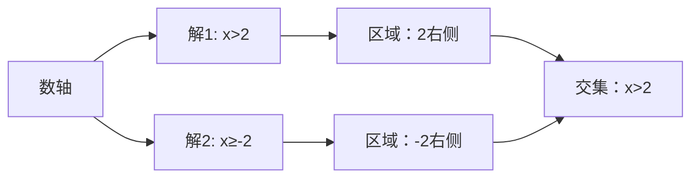

---
{"dg-publish":true,"permalink":"/02////","tags":["数学/代数/函数"]}
---

一元一次不等式组是由**两个或两个以上一元一次不等式**组合而成的系统，其解集需同时满足所有不等式。以下是系统总结，涵盖解法、应用及易错点：

---

### 📌 ​**一、基本概念与解集定义**​

#### ​**1. 基本形式**​

$$
\begin{cases}
a_1 x + b_1 \geq c_1 \\
a_2 x + b_2 < c_2 \\
\cdots \\
a_n x + b_n \neq c_n
\end{cases}
$$

- ​**解集**​：所有满足**每一个不等式**的 $x$ 的集合。
- ​**关键特征**​：解集是各不等式解集的**交集**​（$\bigcap$）。

#### ​**2. 解集类型**​

|​**类型**​|​**条件**​|​**示例**​|
|---|---|---|
|​**有解**​|存在公共解区间|$\begin{cases} x > 2 \\ x < 5 \end{cases}$ → $2 < x < 5$|
|​**无解**​|解集无交集（空集）|$\begin{cases} x \geq 4 \\ x \leq 1 \end{cases}$ → $\varnothing$|
|​**无限解**​|解集为全体实数（需验证）|$\begin{cases} x + 1 > 0 \\ x - 3 < 10 \end{cases}$ → $\mathbb{R}$|

---

### ⚙️ ​**二、核心解法与步骤**​

#### ​**1. 标准解法（四步法）​**​

1. ​**解单个不等式**​：分别求出每个不等式的解集。
    
    > $\begin{cases} 2x - 3 > 1 \quad (1) \\ -x + 4 \leq 6 \quad (2) \end{cases}$  
    > (1) $2x > 4 \implies x > 2$  
    > (2) $-x \leq 2 \implies x \geq -2$（**注意**​：除以负数反转不等号）
    
2. ​**画数轴找交集**​：将解集标在数轴上，取重叠部分。
    

    
3. ​**验证边界点**​：检查等号是否成立（如 $\geq$ 包含端点）。
    
    > $x=2$：代入(1) $2\times2-3=1 \not> 1$ → ​**不包含**​（严格大于）
    
4. ​**写出解集**​：用区间或不等式表示最终解。
    
    > 解集：$x > 2$ 或 $(2, +\infty)$
    

#### ​**2. 口诀速记解集规则**​

|​**规则**​|​**描述**​|​**示例**​|​**解集**​|
|---|---|---|---|
|​**同大取大**​|多个 $>$ 取最大下限|$\begin{cases} x > 1 \\ x > 3 \end{cases}$|$x > 3$|
|​**同小取小**​|多个 $<$ 取最小上限|$\begin{cases} x < 5 \\ x < 2 \end{cases}$|$x < 2$|
|​**大小小大中间找**​|下限 $\geq$ 上限 $\leq$|$\begin{cases} x \geq 2 \\ x \leq 5 \end{cases}$|$2 \leq x \leq 5$|
|​**大大小小无解了**​|下限 > 上限|$\begin{cases} x > 4 \\ x < 1 \end{cases}$|空集（$\varnothing$）|

---

### 🔍 ​**三、含参数与特殊类型**​

#### ​**1. 含参数不等式组**​

- ​**问题**​：$\begin{cases} kx + 1 > 0 \\ 2x - k \leq 3 \end{cases}$（$k$ 为参数）
- ​**解法**​：
    1. 解各不等式：
        - $kx > -1$ → 若 $k>0$，$x > -\frac{1}{k}$；若 $k<0$，$x < -\frac{1}{k}$
        - $2x \leq k + 3 \implies x \leq \frac{k+3}{2}$
    2. ​**分类讨论**​ $k$ 的符号，求交集并验证边界。

#### ​**2. 绝对值不等式组**​

- ​**示例**​：$\begin{cases} |x-2| < 3 \\ |x+1| \geq 1 \end{cases}$
- ​**解法**​：
    1. 拆绝对值：
        - $|x-2|<3 \implies -3 < x-2 < 3 \implies -1 < x < 5$
        - $|x+1| \geq 1 \implies x \leq -2$ 或 $x \geq 0$
    2. 取交集：$(-1 < x < 5) \cap (x \leq -2 \text{ 或 } x \geq 0)$ → $0 \leq x < 5$

---

### 🌐 ​**四、实际应用场景**​

#### ​**1. 生活问题建模**​

|​**问题**​|​**不等式组模型**​|​**解集意义**​|
|---|---|---|
|​**购物满减**​|$\begin{cases} x \geq 100 \\ 0.8x \leq 150 \end{cases}$（满100打8折，预算150）|$100 \leq x \leq 187.5$（购买金额范围）|
|​**温度控制**​|$\begin{cases} T \geq 18^\circ \text{C} \\ T \leq 26^\circ \text{C} \end{cases}$|空调设定温度区间|
|​**成绩达标**​|$\begin{cases} 60 \leq \text{语文} \leq 100 \\ 70 \leq \text{数学} \leq 100 \end{cases}$|各科分数要求|

#### ​**2. 几何约束条件**​

- ​**三角形存在条件**​：
    
    $$
    \begin{cases}
    a + b > c \\
    a + c > b \\
    b + c > a
    \end{cases}
    ,（边长 a, b, c > 0）
    $$
    
    
    
- ​**矩形面积与周长**​：  
    $\begin{cases} 2(l + w) = 20 \\ lw \geq 24 \end{cases}$ → 求长 $l$、宽 $w$ 的可能值。

---

### ⚠️ ​**五、易错点与避坑指南**​

|​**错误类型**​|​**典型案例**​|​**纠正方法**​|
|---|---|---|
|​**未取交集**​|$\begin{cases} x > 1 \\ x < 3 \end{cases}$ 解为 $x>1$（漏 $x<3$）|画数轴确认交集区间|
|​**边界点错误**​|$\begin{cases} x \geq 2 \\ x > 2 \end{cases}$ 解为 $x \geq 2$（应为 $x > 2$）|代入验证等号是否成立|
|​**参数讨论遗漏**​|含 $k$ 时未分 $k>0$ 和 $k<0$ 情况|分类覆盖所有可能|
|​**绝对值转化不全**​|$|x-1|

---

### 💎 ​**六、总结与学习建议**​

​**不等式组的核心价值**​：

1. ​**条件组合**​：解决多约束实际问题（如资源分配、几何存在性）；
2. ​**逻辑训练**​：培养交集思维与分类讨论能力；
3. ​**数学工具**​：为线性规划（高中）奠定基础。

​**学习路径**​：  
1️⃣ ​**基础**​：熟练单个不等式解法（移项、变号）；  
2️⃣ ​**核心**​：掌握数轴图示法与解集口诀（同大取大等）；  
3️⃣ ​**进阶**​：攻克含参问题与绝对值不等式组；  
4️⃣ ​**应用**​：联系生活场景建模（预算控制、温度区间）。

> ​**数学思想点睛**​：  
> “不等式组是现实的数学镜象”——从生产计划（原料与工时约束）到游戏规则（多条件成就），它量化了复杂世界的平衡艺术。