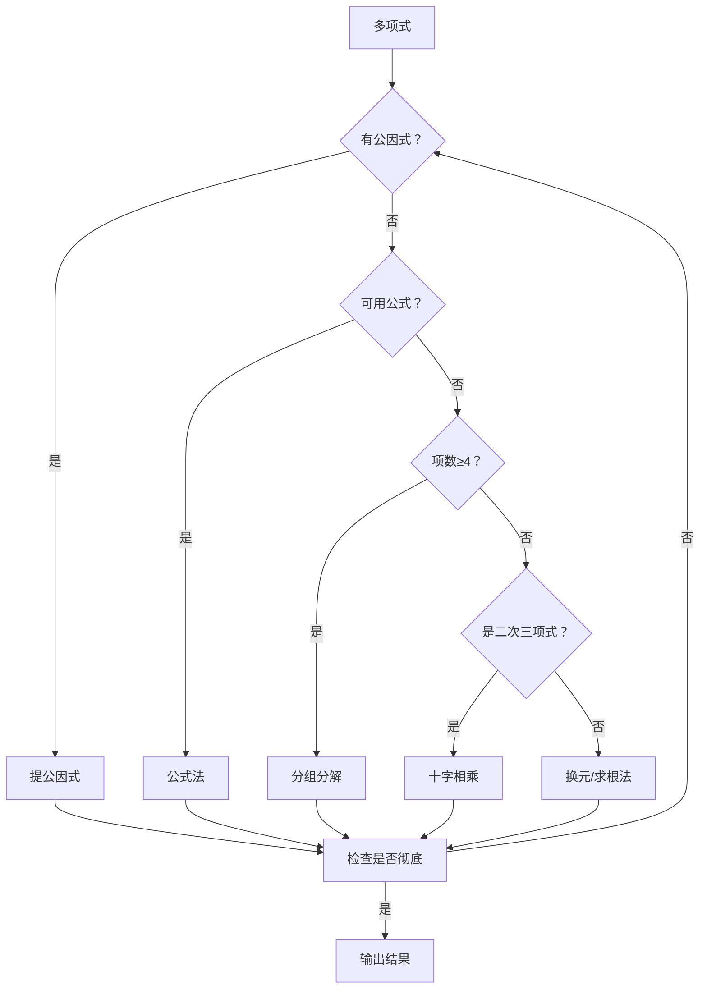

---
{"dg-publish":true,"permalink":"/02////","tags":["数学/代数/运算"]}
---

以下是关于**因式分解**的完整知识体系，涵盖核心方法、步骤拆解、技巧与应用场景，助您系统掌握这一核心代数工具：

---

### 📌 一、因式分解的定义与意义

1. ​**基本定义**​：  
    将多项式转化为**几个整式乘积的形式**​（如 $ax^2 + bx + c \to (px + q)(rx + s)$）。
2. ​**核心目的**​：
    - 简化代数式（如分式约分）
    - 解高次方程（降次）
    - 分析函数性质（求根、最值）

---

### ⚒️ 二、因式分解的6大基本方法

#### ​**1. 提公因式法**​

​**适用对象**​：多项式中所有项含有**公共因式**。  
​**步骤**​：

1. 定系数：取各项系数的**最大公约数**​
2. 定字母：取相同字母的**最低次幂**​
3. 提取：$ka + kb + kc = k(a + b + c)$  
    ​**示例**​：

$$
6x^3 y - 9x^2 y^2 + 3xy = 3xy(2x^2 - 3xy + 1)
$$

#### ​**2. 公式法（核心公式表）​**​

|​**公式名称**​|​**展开形式**​|​**因式形式**​|
|---|---|---|
|平方差公式|$a^2 - b^2$|$(a + b)(a - b)$|
|完全平方公式|$a^2 \pm 2ab + b^2$|$(a \pm b)^2$|
|立方和公式|$a^3 + b^3$|$(a + b)(a^2 - ab + b^2)$|
|立方差公式|$a^3 - b^3$|$(a - b)(a^2 + ab + b^2)$|
|完全立方公式|$a^3 \pm 3a^2b + 3ab^2 \pm b^3$|$(a \pm b)^3$|

​**应用示例**​：

$$
x^2 - 4y^2 = (x + 2y)(x - 2y) \quad \text{（平方差）}
$$

#### ​**3. 分组分解法**​

​**适用对象**​：4项及以上多项式（无直接公因式）。  
​**步骤**​：

1. 分组（通常2+2或3+1分组）
2. 组内提公因式/用公式
3. 组间再提公因式  
    ​**关键技巧**​：

- ​**试验分组组合**​（不唯一）
- ​**拆中项法**​：如对 $ax^2 + bx + c$ 拆 $bx$ 为 $mx + nx$  
    ​**示例**​：

$$
\begin{aligned}
x^3 + x^2 + x + 1 &= x^2(x + 1) + (x + 1) \\
&= (x + 1)(x^2 + 1)
\end{aligned}
$$

#### ​**4. 十字相乘法**​

​**适用对象**​：二次三项式 $ax^2 + bx + c$。  
​**步骤**​：

1. 拆分系数：
    - $a = m \times n$
    - $c = p \times q$
2. 交叉验证：确保 $mq + np = b$
3. 写因式：$(mx + p)(nx + q)$  
    ​**示意图**​：

$$
  m   →   p
    ✕  
  n   →   q
→ 满足 m·q + n·p = b
$$

​**示例**​：

$$
2x^2 + 5x + 3 = (2x + 3)(x + 1) \quad \text{（∵ } 2\times1 + 1\times3 = 5\text{）}
$$

#### ​**5. 换元法**​

​**适用对象**​：复杂多项式或重复结构。  
​**步骤**​：

1. 设元替换（如令 $t = x^2 + x$）
2. 对新变量因式分解
3. 回代原变量  
    ​**示例**​：

$$
(x^2 + 4x + 3)(x^2 + 4x + 5) - 3 \quad \text{令 } t = x^2 + 4x
$$

$$
= (t + 3)(t + 5) - 3 = t^2 + 8t + 12 = (t + 6)(t + 2)
$$

#### ​**6. 求根法（因式定理）​**​

​**适用对象**​：高次多项式（≥3次）。  
​**步骤**​：

1. 试根：可能的根为 $\pm \frac{\text{常数项因数}}{\text{首项系数因数}}$
2. 验证 $f(a) = 0$ → 有因式 $(x - a)$
3. 多项式除法降次  
    ​**示例**​：  
    对 $f(x) = x^3 - 3x + 2$，试根：

- $f(1) = 1 - 3 + 2 = 0$ → $(x - 1)$ 是因式
- 除法：$\frac{x^3 - 3x + 2}{x - 1} = x^2 + x - 2$
- 最终分解：$(x - 1)(x^2 + x - 2) = (x - 1)^2 (x + 2)$

---

### 🔍 三、步骤总结与检验

#### ​**分解流程图**​

#### ​**检验标准**​

1. ​**整式乘积形式**​
2. ​**每个因式不可再分**​（在实数范围内）
3. ​**展开后与原式恒等**​（反向验证）

---

### ⚙️ 四、应用场景

#### ​**1. 解高次方程**​

原理：若 $A \cdot B = 0$，则 $A=0$ 或 $B=0$  
​**例**​：  
$x^2 - 5x + 6 = 0 \to (x-2)(x-3)=0 \to x=2 \text{ 或 } x=3$

#### ​**2. 分式化简**​

​**例**​：

$$
\frac{x^2 - 4}{x^2 + 4x + 4} = \frac{(x+2)(x-2)}{(x+2)^2} = \frac{x-2}{x+2}
$$

#### ​**3. 求函数最值**​

​**例**​：  
$f(x) = x^2 - 4x + 3 = (x-2)^2 -1 \geq -1$，最小值在 $x=2$ 时取到。

#### ​**4. 数值计算**​

​**例**​：  
计算 $101^2 - 99^2 = (101-99)(101+99) = 2 \times 200 = 400$

---

### ⚠️ 五、易错点与避坑指南

|​**错误类型**​|​**典型案例**​|​**正确操作**​|
|---|---|---|
|​**分解不彻底**​|$x^4 - 16 = (x^2 + 4)(x^2 - 4)$（漏分解 $x^2 - 4$）|二次项需继续分 $(x^2 - 4) = (x+2)(x-2)$|
|​**符号错误**​|$x^2 - 2x + 1 = (x-1)(x+1)$（应为 $(x-1)^2$）|检查完全平方形式|
|​**忽略系数1**​|$x^2 + x - 2$ 十字相乘误为 $(x+2)(x-1)$|正确应为 $(x+2)(x-1) = x^2 + x - 2$（确认系数）|
|​**实数范围停步**​|$x^2 + 4$ 在实数范围内不可再分|虚数范围可分解为 $(x+2i)(x-2i)$|

---

### 💎 六、总结口诀

> ​**因式分解四步走：一**提**二**套**三**分**四**查漏；**​  
> ​**十字相乘试系数，公式活用是高手；**​  
> ​**高次求根破难点，检验彻底方罢休！​**​

​**经典练习**​：  
分解 $12x^2 y - 8xy^2 - 18x^2 + 12xy$  
​**解答**​：

1. 提公因式 $2x$：
    
    $$
    2x(6xy - 4y^2 - 9x + 6y)
    $$
    
2. 分组：
    
    $$
    2x[(6xy - 9x) + (-4y^2 + 6y)] = 2x[3x(2y - 3) - 2y(2y - 3)]
    $$
    
3. 提组内公因式 $(2y - 3)$：
    
    $$
    2x(2y - 3)(3x - 2y)
    $$
    

​**最终结果**​：$2x(2y - 3)(3x - 2y)$ ✅