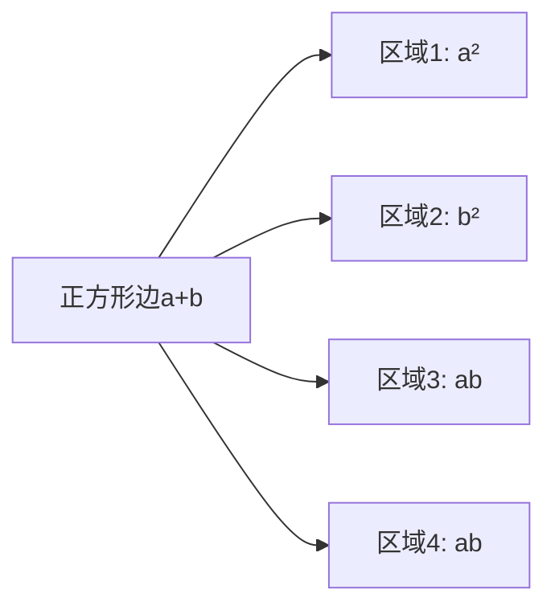

---
{"dg-publish":true,"permalink":"/02////","tags":["数学/代数/运算"]}
---

完全平方是代数中的核心概念，指某个**整式或数可写为另一个整式/数的平方**，其标准形式为 $(a \pm b)^2 = a^2 \pm 2ab + b^2$。以下是系统总结：

---

### 📌 ​**一、基本公式与变形**​

#### ​**1. 基本恒等式**​

> [!NOTE] 定义
> 
> |​**公式**​|​**展开式**​|​**几何意义**​（面积模型）|
> |---|---|---|
> |$(a + b)^2$|$a^2 + 2ab + b^2$|边长为 $a + b$ 的正方形面积分割：   • $a^2$（大正方形）   • $b^2$（小正方形）   • $2ab$（两个矩形）|
> |$(a - b)^2$|$a^2 - 2ab + b^2$|边长为 $a$ 的正方形中切除边长为 $b$ 的区域后剩余面积|
> 

#### ​**2. 关键变形**​

- ​**数值优化**​：$a^2 + b^2 = (a \pm b)^2 \mp 2ab$（如 $7^2 + 3^2 = (7+3)^2 - 2 \times 7 \times 3 = 100 - 42 = 58$)
- ​**配方法基础**​：二次多项式 $x^2 + px + q$ 配完全平方：
    
    $$
    x^2 + px + q = \left( x + \frac{p}{2} \right)^2 + \left( q - \frac{p^2}{4} \right)
    $$
    
- ​**三元扩展**​：$(a + b + c)^2 = a^2 + b^2 + c^2 + 2ab + 2bc + 2ca$

---

### 🧠 ​**二、判断与推导方法**​

#### ​**1. 识别完全平方式**​

整式 $f(x)$ 为完全平方的充要条件：

- 形如 $k(mx + n)^2$（$k, m, n$ 为常数）
- ​**判别标准**​：
    - 二次多项式 $ax^2 + bx + c$ 的判别式 ​**​$\Delta = b^2 - 4ac = 0$​**​

​**示例**​：

- $4x^2 - 12x + 9$：∵ $\Delta = (-12)^2 - 4 \times 4 \times 9 = 0$ → $(2x-3)^2$
- $x^2 + 4x + 5$：∵ $\Delta = 4^2 - 4 \times 1 \times 5 = -4 \neq 0$ → 非完全平方

#### ​**2. 推导与证明方法**​

- ​**代数展开**​：
    
    $$
    (a+b)^2 = (a+b)(a+b) = a(a) + a(b) + b(a) + b(b) = a^2 + 2ab + b^2
    $$
    
- ​**几何直观**​（以 $(a+b)^2$ 为例）：
    

    

---

### 🔍 ​**三、核心应用场景**​

#### ​**1. 数值速算技巧**​

|​**类型**​|​**公式应用**​|​**示例**​|
|---|---|---|
|两位数平方|$(10a+b)^2 = 100a^2 + 20ab + b^2$|$23^2 = 200 \times 4 + 20 \times 6 + 9 = 529$|
|接近整数的平方|$(100 \pm x)^2 = 10000 \pm 200x + x^2$|$97^2 = (100-3)^2 = 10000 - 600 + 9 = 9409$|
|小数平方|$(a.b)^2 = (a+0.b)^2$|$5.1^2 = (5+0.1)^2 = 25 + 1 + 0.01 = 26.01$|

#### ​**2. 代数解题应用**​

- ​**因式分解**​：  
    $x^2 + 6x + 9 = (x+3)^2$  
    $4a^2 - 12ab + 9b^2 = (2a-3b)^2$
- ​**解方程**​（配方法）：  
    $x^2 + 6x + 5 = 0 \rightarrow x^2 + 6x + 9 = 4 \rightarrow (x+3)^2 = 4$
- ​**求最值**​：  
    $x^2 - 4x + 7 = (x-2)^2 + 3 \geq 3$（最小值3）

#### ​**3. 几何与物理模型**​

- ​**勾股定理推广**​：$(a+b)^2 = c^2 + 4 \times (\frac{1}{2}ab)$（直角三角形外接正方形）
- ​**动能公式**​：$E_k = \frac{1}{2}mv^2$（速度平方关系）

---

### ⚠️ ​**四、常见错误与技巧**​

|​**错误类型**​|​**典型案例**​|​**纠正策略**​|
|---|---|---|
|​**漏交叉项**​|$(x+y)^2 = x^2 + y^2$ ❌|口诀：“**前平方，后平方，两倍乘积放中央**”|
|​**符号错误**​|$(-a-b)^2 = -a^2 -2ab -b^2$ ❌|牢记：$(-a)^2 = a^2$，且 $(-a)(-b)=ab$|
|​**配方漏项**​|$x^2 + 4x + 4$ 配成 $(x+2)^2 + 0$ 忽略常数项 ❌|严格步骤：   1. 加一次项系数一半的平方；   2. 减去相同项保持等式|

---

### 💎 ​**总结与学习建议**​

完全平方的核心价值：

- ​**简化运算**​：数值心算与代数化简的利器；
- ​**统一结构**​：连通因式分解、方程求解、函数最值三大领域；
- ​**桥梁作用**​：为配方法、二次函数图像分析、均值不等式提供基础。

​**学习路径**​：

1. ​**基础巩固**​：熟记公式 $(a \pm b)^2$ 及几何意义；
2. ​**技能进阶**​：掌握配方法在二次函数最值中的应用（如抛物线顶点）；
3. ​**拓展延伸**​：探索完全平方在不等式（如 $a^2 + b^2 \geq 2ab$）中的推导。

> ​**高斯启示**​：数学的美在于简洁，完全平方将多项式复杂性凝练为对称的统一结构。掌握此工具，代数世界将迎刃而解。