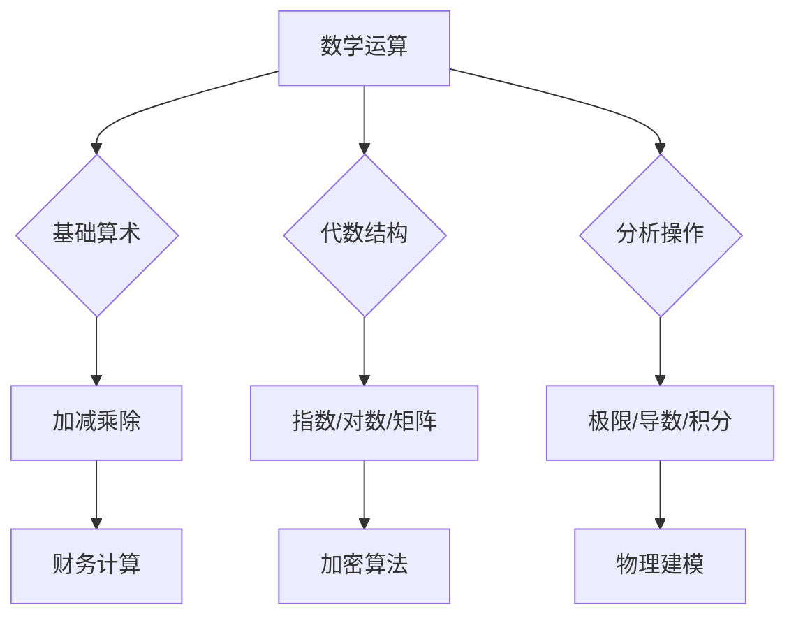

---
{"dg-publish":true,"permalink":"/02////"}
---

数学运算是指**遵循特定数学规则的符号操作过程**，它构成了数学推理与科学计算的基石。本文从基础到高阶系统分类，覆盖定义、规则、工具及应用场景，助您构建完整运算体系：

---

### 📌 ​**一、运算的分类与层级**​

#### ​**1. 基础算术运算**​

|​**运算**​|​**符号**​|​**定义**​|​**示例**​|​**性质**​|
|---|---|---|---|---|
|加法|+|合并数量|5 + 3 = 8|交换律：a+b=b+a|
|减法|-|从总量中移除|8 - 3 = 5|逆运算：a-b= a+(-b)|
|乘法|× 或 ·|重复加法|4 × 3 = 12|分配律：a(b+c)=ab+ac|
|除法|÷ 或 /|分配至等份|12 ÷ 3 = 4|乘法逆：a÷b= a×¹⁄b|

​**重要性质**​：

- ​**优先级规则（PEMDAS）​**​：括号 → 指数 → 乘除（左→右） → 加减（左→右）
    
    > 例：$12 ÷ 3 × (4 - 2)^2 = 12 ÷ 3 × 4 = 16$
    

#### ​**2. 高阶代数运算**​

|​**运算类型**​|​**核心对象**​|​**运算规则**​|​**应用领域**​|
|---|---|---|---|
|指数运算|$a^n$|$a^m × a^n = a^{m+n}$|复利计算/核衰变|
|对数运算|$\log_b a$|$\log_b (xy) = \log_b x + \log_b y$|信号强度/酸碱度|
|根式运算|$\sqrt[n]{a}$|$\sqrt{a} × \sqrt{b} = \sqrt{ab}$|几何距离/波动方程|
|矩阵运算|$\mathbf{A}_{m×n}$|$\mathbf{A} + \mathbf{B}$，$\mathbf{A}\mathbf{B}$（行×列）|计算机图形/量子力学|

---

### ⚙️ ​**二、特殊运算规则与技巧**​

#### ​**1. 有理数与分数运算**​

|​**规则**​|​**公式示例**​|​**技巧**​|
|---|---|---|
|分数加法|$\frac{a}{c} + \frac{b}{c} = \frac{a+b}{c}$|通分找最小公分母|
|带分数乘法|$2\frac{1}{3} × \frac{4}{5} = \frac{7}{3} × \frac{4}{5} = \frac{28}{15}$|先化为假分数|
|倒数应用|$\frac{a}{b} ÷ \frac{c}{d} = \frac{a}{b} × \frac{d}{c}$|除法转乘法简化|

#### ​**2. 极限与微积分运算**​

|​**概念**​|​**符号操作**​|​**案例**​|
|---|---|---|
|导数|$\frac{d}{dx} x^2 = 2x$|瞬时速度：位移s(t)求导 → v(t)|
|积分|$\int_0^1 x^2 dx = \frac{1}{3}$|曲线下面积计算|
|洛必达法则|$\lim_{x→0}\frac{\sin x}{x} = \lim_{x→0}\cos x =1$|求解 $\frac{0}{0}$/$\frac{∞}{∞}$极限|

---

### 🔍 ​**三、运算在科学模型中的应用**​

#### ​**1. 物理建模**​

|​**公式**​|​**运算逻辑**​|​**应用场景**​|
|---|---|---|
|牛顿第二定律|$F = m \cdot a$|力与加速度乘法关系|
|爱因斯坦质能方程|$E = m \cdot c^2$|指数运算（c为光速常量）|
|万有引力定律|$F = G \frac{m_1 m_2}{r^2}$|乘除与平方反比运算|

#### ​**2. 经济与大数据模型**​

|​**模型**​|​**运算表达式**​|​**意义**​|
|---|---|---|
|复利增长|$A = P(1 + r/n)^{nt}$|指数运算与频率n的关联|
|回归分析|$y = \beta_0 + \beta_1 x + \epsilon$|矩阵求逆解系数 ($\mathbf{\beta} = (\mathbf{X}^T\mathbf{X})^{-1} \mathbf{X}^T\mathbf{y}$)|
|马尔可夫链|$\mathbf{P}^{(n)} = \mathbf{P}^n$|状态转移矩阵的幂运算|

---

### ⚠️ ​**四、常见错误与校验方法**​

|​**错误类型**​|​**典型案例**​|​**规避策略**​|
|---|---|---|
|零除错误|$\frac{a}{0}$ 导致系统崩溃|编程添加if(b!=0)条件校验|
|浮点精度丢失|0.1 + 0.2 ≠ 0.3（二进制截断）|使用Decimal类型（Python）|
|矩阵乘法维度不符|$\mathbf{A}_{2×3} × \mathbf{B}_{2×3}$ 非法|检查前列数=后行数|
|极限混淆连续|$\lim_{x→0} \frac{1}{x} = ∞$ 而非连续值|严格左/右极限定义|

---

### 🛠️ ​**五、运算能力提升工具**​

|​**工具类型**​|​**推荐工具**​|​**核心功能**​|
|---|---|---|
|符号计算|Mathematica|解方程、微积分符号运算|
|数值分析|MATLAB|矩阵运算/ODE求解/FFT分析|
|编程验证|Python（SymPy库）|自动推导公式（如导数/积分）|
|可视化|GeoGebra|动态演示运算几何意义|

---

### 💎 ​**总结：数学运算的认知框架**​

​**核心原则**​：

1. ​**确定性规则**​：运算依赖严格公理（如交换律、结合律）；
2. ​**层次递进**​：从离散算术到连续分析；
3. ​**工具适配**​：根据场景选择心算/笔算/机算；
4. ​**逻辑验证**​：结果需满足数学与物理约束。

> ​**毕达哥拉斯箴言**​：“万物皆数，数皆可算”——掌握运算规则即握有解码世界的数学钥匙。