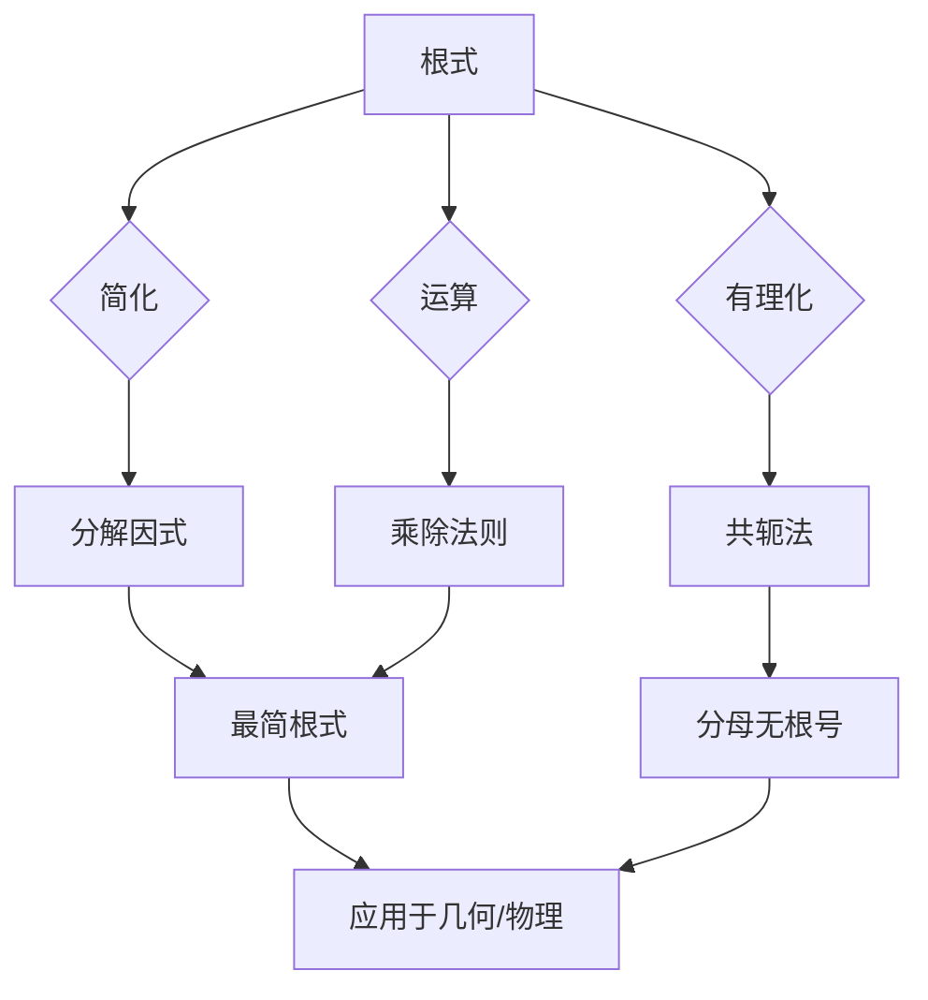

---
{"dg-publish":true,"permalink":"/02////","tags":["数学/代数/运算"]}
---

根式运算是处理包含**根号（√）​**​ 的代数表达式的方法，核心在于简化、运算与有理化。以下是系统总结，涵盖定义、法则、技巧及实际应用：

---

### 📌 ​**一、根式定义与基本性质**​

#### ​**1. 基本概念**​

|​**形式**​|​**数学表示**​|​**含义**​|​**示例**​|
|---|---|---|---|
|平方根|$\sqrt{a}$|满足 $x^2 = a$ 的非负数解|$\sqrt{9} = 3$|
|n次方根|$\sqrt[n]{a}$|满足 $x^n = a$ 的实数解|$\sqrt[3]{8} = 2$|
|算术根|$\sqrt[n]{a} \geq 0$（$a \geq 0$）|​**非负**根（默认值）|$\sqrt{4} = 2$（非-2）|

​**定义域限制**​：

- ​**偶数次根号**​（如 $\sqrt{a}, \sqrt[4]{a}$)：被开方数 $a \geq 0$
- ​**奇数次根号**​（如 $\sqrt[3]{a}, \sqrt[5]{a}$)：被开方数 $a \in \mathbb{R}$（可负）

---

### ⚙️ ​**二、根式运算法则与化简**​

#### ​**1. 基础运算法则**​

|​**法则**​|​**公式**​|​**示例**​|
|---|---|---|
|​**乘法法则**​|$\sqrt{a} \cdot \sqrt{b} = \sqrt{ab}$（$a,b \geq 0$)|$\sqrt{2} \cdot \sqrt{8} = \sqrt{16} = 4$|
|​**除法法则**​|$\frac{\sqrt{a}}{\sqrt{b}} = \sqrt{\frac{a}{b}}$（$a \geq 0, b > 0$)|$\frac{\sqrt{18}}{\sqrt{2}} = \sqrt{9} = 3$|
|​**乘方与开方复合**​|$(\sqrt[n]{a})^m = \sqrt[n]{a^m}$|$(\sqrt[3]{8})^2 = \sqrt[3]{64} = 4$|
|​**根指数化简**​|$\sqrt[n]{a^m} = a^{\frac{m}{n}}$|$\sqrt[4]{x^2} = x^{\frac{1}{2}} = \sqrt{x}$（$x \geq 0$)|

#### ​**2. 最简根式标准**​

1. ​**无分母根号**​：如 $\frac{\sqrt{3}}{2}$（非 $\frac{1}{\sqrt{3}}$)
2. ​**被开方数无平方因子**​：
    - $\sqrt{50} = \sqrt{25 \times 2} = 5\sqrt{2}$
    - $\sqrt[3]{54} = \sqrt[3]{27 \times 2} = 3\sqrt[3]{2}$
3. ​**指数互质**​：$\sqrt[6]{a^2} = \sqrt[3]{a}$（约分指数：$\frac{2}{6} = \frac{1}{3}$)

---

### 🔢 ​**三、分母有理化技巧**​

​**目标**​：消去分母中的根号，便于计算与近似值估算。

|​**分母类型**​|​**有理化方法**​|​**示例**​|
|---|---|---|
|​**单根号**​|分子分母同乘相同根式|$\frac{1}{\sqrt{3}} = \frac{\sqrt{3}}{3}$|
|​**和/差式**​（如 $a \pm \sqrt{b}$）|乘共轭表达式 $(a \mp \sqrt{b})$|$\frac{2}{3 - \sqrt{5}} = \frac{2(3 + \sqrt{5})}{(3)^2 - (\sqrt{5})^2} = \frac{2(3 + \sqrt{5})}{4} = \frac{3 + \sqrt{5}}{2}$|
|​**复合根式**​|多次有理化或配方|$\frac{1}{\sqrt{2} + \sqrt{3}} = \frac{\sqrt{3} - \sqrt{2}}{3 - 2} = \sqrt{3} - \sqrt{2}$|

---

### 🧮 ​**四、根式运算的应用场景**​

#### ​**1. 几何距离与面积**​

|​**公式**​|​**应用**​|
|---|---|
|两点距离|$d = \sqrt{(x_2 - x_1)^2 + (y_2 - y_1)^2}$|
|勾股定理|$c = \sqrt{a^2 + b^2}$（斜边）|
|圆面积|$S = \pi r^2$ → $r = \sqrt{\frac{S}{\pi}}$|

#### ​**2. 物理与工程模型**​

|​**公式**​|​**意义**​|
|---|---|
|自由落体位移|$s = \frac{1}{2}gt^2$ → $t = \sqrt{\frac{2s}{g}}$|
|交流电阻抗|$Z = \sqrt{R^2 + (X_L - X_C)^2}$|
|弹簧振子周期|$T = 2\pi \sqrt{\frac{m}{k}}$|

#### ​**3. 金融与统计**​

- ​**标准差**​：$\sigma = \sqrt{\frac{1}{n}\sum (x_i - \mu)^2}$（数据离散度）
- ​**波动率计算**​：$\text{Volatility} = \sqrt{\frac{1}{T} \sum r_t^2}$（对数收益率标准差）

---

### ⚠️ ​**五、常见错误与避坑指南**​

|​**错误类型**​|​**典型案例**​|​**正确方法**​|
|---|---|---|
|​**定义域忽略**​|$\sqrt{x^2} = x$（未考虑符号）|$ \sqrt{x^2} =|
|​**错误分解**​|$\sqrt{a + b} = \sqrt{a} + \sqrt{b}$ ❌|确认：$\sqrt{9+16} = 5 \neq 3 + 4$|
|​**遗漏共轭**​|$\frac{1}{1 - \sqrt{2}}$ 直接写为 $\frac{1}{1 - \sqrt{2}}$（未有理化）|乘共轭 $(1 + \sqrt{2})$|
|​**负数的奇次根**​|$\sqrt[3]{-8} = -2$ 正确，但 $\sqrt[4]{-16}$ 在实数范围无解|区分奇偶次根号定义域|

---

### 💎 ​**六、解题技巧与工具推荐**​

#### ​**1. 化简策略**​

1. ​**分解质因数**​：  
    $\sqrt{72} = \sqrt{36 \times 2} = 6\sqrt{2}$
2. ​**变量代换**​：  
    解 $x + \sqrt{x} - 6 = 0$ → 令 $t = \sqrt{x}$ → $t^2 + t - 6 = 0$ → $t = 2$ → $x = 4$
3. ​**配方消根号**​：  
    $\sqrt{3 + 2\sqrt{2}} = \sqrt{(\sqrt{2} + 1)^2} = \sqrt{2} + 1$（需验证 $1 + \sqrt{2} > 0$)

#### ​**2. 工具辅助**​

|​**工具类型**​|​**推荐工具**​|​**使用场景**​|
|---|---|---|
|科学计算器|Casio fx-991CN X|直接计算 $\sqrt[5]{100} \approx 2.511$|
|数学软件|Mathematica|符号化简：$Simplify[Sqrt[20]]$ → $2\sqrt{5}$|
|在线工具|WolframAlpha|输入 $rationalize 1/(1+sqrt(3))$ 得 $\frac{\sqrt{3} - 1}{2}$|

---

### ​**总结与学习路径**​

​**根式运算核心逻辑**​：

​**学习建议**​：  
1️⃣ ​**基础强化**​：熟记乘除法则与定义域限制；  
2️⃣ ​**技巧演练**​：掌握分母有理化（单根式、差式、嵌套根式）；  
3️⃣ ​**实践验证**​：结合几何问题（如勾股定理）巩固根式意义；  
4️⃣ ​**工具辅助**​：利用计算器验证复杂根式计算结果。

> ​**毕达哥拉斯学派的教训**​：  
> 发现 $\sqrt{2}$ 的希帕索斯证明了根式的“不可比性”，也揭示数学必须超越直觉。掌握根式运算，即掌握连通代数与几何的钥匙。