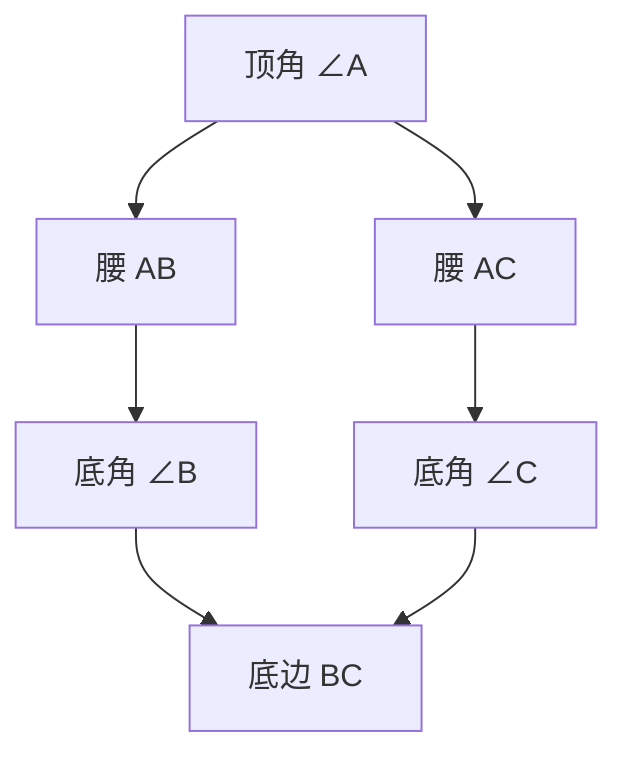

---
{"dg-publish":true,"permalink":"/02/////","title":"等腰三角形","tags":["数学/几何/三角形"]}
---

以下是关于**等腰三角形**的全面解析，涵盖定义、性质、判定方法及解题技巧（附几何图示与公式）：

---

### 📐 ​**一、基本定义与要素**​

1. ​**定义**​：  
    有**两条边相等**的三角形（或**两个角相等**的三角形）。
    - ​**相等的边**称为**腰**​（AB = AC）
    - ​**第三条边**称为**底边**​（BC）
    - ​**两腰夹角**称为**顶角**​（∠BAC）
    - ​**底边与腰的夹角**称为**底角**​（∠ABC = ∠ACB）

---

### 🔍 ​**二、核心性质（5大定理）​**​

|​**性质**​|​**数学表达**​|​**几何意义**​|
|---|---|---|
|​**等边对等角**​|$AB = AC \iff \angle B = \angle C$|腰相等 → 底角相等|
|​**三线合一**​|顶角平分线、底边中线、高线**重合**​|一条线具备三种身份（AD⊥BC, BD=DC, ∠BAD=∠CAD）|
|​**轴对称性**​|沿底边高线（AD）折叠后重合|对称轴是底边的高线|
|​**底角恒锐角**​|$\angle B < 90^\circ$, $\angle C < 90^\circ$|等腰三角形底角必为锐角|
|​**周长公式**​|$C = 2a + b$（a为腰长，b为底边）|两腰加底边|

---

### ⚖️ ​**三、判定方法（4种）​**​

|​**条件**​|​**推理逻辑**​|​**示例**​|
|---|---|---|
|​**定义法**​|有两条边相等|$AB = AC$ → △ABC等腰|
|​**等角对等边**​|有两个角相等|$\angle B = \angle C$ → $AB = AC$|
|​**三线合一定理逆用**​|一条线同时是中线和高线（或角平分线）|AD⊥BC 且 BD=DC → △ABC等腰|
|​**对称性逆推**​|沿某直线折叠后重合|若△ABC沿AD对称 → AB=AC|

---

### 📏 ​**四、特殊类型：等边三角形**​

1. ​**定义**​：三条边均相等的三角形（是等腰三角形的特例）。
2. ​**性质拓展**​：
    - 三内角均为 $60^\circ$
    - 任意高线/中线/角平分线三线合一
    - 轴对称图形（3条对称轴）

---

### 🧩 ​**五、解题技巧与应用**​

#### ​**1. 求角度（核心方法）​**​

- ​**原则**​：利用 $\angle A + \angle B + \angle C = 180^\circ$ 及 $\angle B = \angle C$  
    ​**例**​：等腰△ABC中，$\angle A = 40^\circ$，求底角。
    
    $$
    \angle B = \angle C = \frac{180^\circ - 40^\circ}{2} = 70^\circ
    $$
    

#### ​**2. 求边长（分类讨论）​**​

- ​**已知两边**​：需判断哪条是底边（可能有两解）  
    ​**例**​：等腰三角形两边长为 3 和 6，求周长。
    - 若腰=3，底=6 → $3+3=6$（不满足两边和>第三边 ❌）
    - 若腰=6，底=3 → 周长= $6+6+3=15$（✅）

#### ​**3. 证明题（辅助线技巧）​**​

|​**辅助线**​|​**适用场景**​|​**目的**​|
|---|---|---|
|​**作底边高线**​|已知角或边关系求长度|构造直角三角形，用勾股定理|
|​**作顶角平分线**​|证明线段相等或角相等|利用三线合一性质|
|​**截长补短**​|证明线段和差关系（如 AB+CD=EF）|构造等腰三角形转移线段|

---

### ⚠️ ​**六、易错点与避坑指南**​

|​**错误类型**​|​**典型案例**​|​**正确做法**​|
|---|---|---|
|​**忽略分类讨论**​|已知等腰三角形两边长未分腰/底|验证三角形存在条件（两边和>第三边）|
|​**混淆高线位置**​|钝角等腰三角形的高在外部，误认为在内部|画图分析（顶角为钝角时高在外）|
|​**误用三线合一**​|未证明全等直接使用三线合一|先证等腰，再用性质|

---

### 🌐 ​**七、实际应用场景**​

|​**领域**​|​**应用案例**​|​**原理**​|
|---|---|---|
|​**建筑结构**​|金字塔侧面、屋顶三角架|等腰三角稳定性高|
|​**艺术设计**​|对称图案（如埃舍尔版画）|轴对称美感|
|​**测量计算**​|利用等腰三角测不可达距离|构造等腰△求高度（如图）|
|​**物理力学**​|桥梁桁架的等腰三角单元|分散承重应力|

---

### 💎 ​**八、总结口诀**​

> ​**等腰三角形，两腰底角等；**​  
> ​**三线合一显神通，对称折叠不变形；**​  
> ​**求角活用内角和，求边分类要谨慎！​**​

​**经典练习**​：  
等腰△ABC 中，AB = AC，BD 为高线交 AC 于 D，∠ABD = 30°，求 ∠BAC。  
​**解**​：

- BD⊥AC → ∠ADB = 90°
- ∠ABD = 30° → ∠BAD = 60°
- AB = AC → ∠ABC = ∠ACB
- 设 ∠ACB = x，则 ∠ABC = x
- ∠BAC = 180° - 2x
- 在△ABD中：∠BAD + ∠ABD + ∠ADB = 180°  
    $60^\circ + 30^\circ + 90^\circ = 180^\circ$（恒成立）
- ​**关键**​：∠BAC = ∠BAD = 60°（无需用x）  
    ​**答案**​：∠BAC = 60°

掌握等腰三角形性质，可高效解决几何证明与计算问题，建议结合动态几何软件（如GeoGebra）观察三线合一与对称变换！