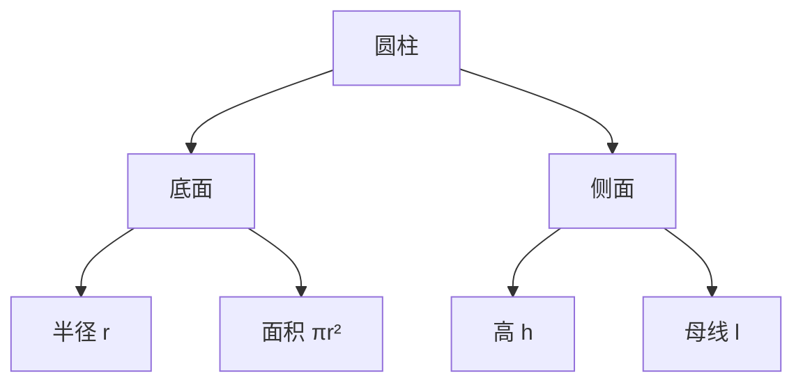

---
{"dg-publish":true,"permalink":"/02/////","tags":["数学/几何/圆"]}
---

以下是关于**圆柱**的核心知识体系梳理，涵盖定义、公式、推导与应用（附逻辑导图）：

---

### 🧱 一、基本概念与结构

1. ​**定义**​：  
    由两个**平行且全等的圆面**​（底面）和一个**侧面**​（矩形/平行四边形卷曲形成）围成的几何体。
    
    - ​**直圆柱**​：母线垂直于底面 → 侧面为矩形
    - ​**斜圆柱**​：母线与底面不垂直 → 侧面为平行四边形
2. ​**关键要素**​：
    
    |名称|符号|说明|
    |---|---|---|
    |底面半径|$r$|底面圆的半径|
    |高（母线）|$h$|两底面间的垂直距离|
    |母线长|$l$|侧面展开边长（直圆柱 $l=h$)|
    |轴|——|连接两底面圆心的直线|
    

---

### 📐 二、核心公式与推导

#### ​**​(1) 侧面积 $S_{\text{侧}}$​**​

- ​**公式**​： $S_{\text{侧}} = 2\pi r h$
- ​**推导**​：侧面展开为矩形（长=底面周长 $2\pi r$，宽=高 $h$）→ 面积 = 长 × 宽

#### ​**​(2) 底面积 $S_{\text{底}}$​**​

- ​**公式**​： $S_{\text{底}} = \pi r^2$（单底） → 两底共 $2\pi r^2$

#### ​**​(3) 表面积 $S_{\text{表}}$​**​

- ​**公式**​： $S_{\text{表}} = S_{\text{侧}} + 2S_{\text{底}} = 2\pi r h + 2\pi r^2 = 2\pi r (h + r)$

#### ​**​(4) 体积 $V$​**​

- ​**公式**​： $V = S_{\text{底}} \cdot h = \pi r^2 h$
- ​**推导**​：祖暅原理（底面积累加）或 微积分切片积分 $V = \int_{0}^{h} \pi r^2 \, dx$

---

### 🔍 三、展开图与空间关系

1. ​**侧面展开图**​：
    
    - 直圆柱 → ​**矩形**​（长=$2\pi r$，宽=$h$)
    - 斜圆柱 → ​**平行四边形**​
2. ​**截面性质**​：
    
|截面方向|形状|条件|
|---|---|---|
|平行于底面|圆（半径 $r$)|与底面全等|
|垂直于底面|矩形（宽 $h$, 长 $2r$)|过轴线时最大|
|倾斜于底面|椭圆|不平行也不过轴|
    

---

### ⚙️ 四、实际应用场景

1. ​**工程设计**​：
    
    - 水管/油罐容积计算 → $V = \pi r^2 h$（需考虑壁厚 $r_{\text{内}} = r - \delta$)
    - 滚筒包装材料面积 → $S_{\text{侧}} = 2\pi r h$
2. ​**建筑与制造**​：
    
    - 立柱承重能力 → 底面积 $S_{\text{底}}$ 影响压强
    - 卷材下料优化（如铁皮卷制烟囱）→ 展开矩形尺寸计算
3. ​**物理模型**​：
    
    - 转动惯量 $I = \frac{1}{2}mr^2$（均匀实心圆柱绕轴）
    - 流体在管道中的层流速度分布 → 圆柱坐标系下求解

---

### ⚠️ 五、易错点与解题技巧

1. ​**单位统一**​：
    
    - 半径 $r$、高 $h$ 需同为米（m）→ 体积单位为 $\text{m}^3$
2. ​**表面积陷阱**​：
    
    - 无盖圆柱（如水池）→ $S_{\text{表}} = S_{\text{侧}} + S_{\text{底}}$
    - 空心圆柱（管状）→ $S_{\text{表}} = S_{\text{外}} + S_{\text{内}} + S_{\text{顶环}} + S_{\text{底环}}$
3. ​**最优问题**​：
    
    - 固定体积 $V$ 时，最小表面积的条件 → $h = 2r$（证明用均值不等式）

---

### 💎 六、与旋转体的关联

圆柱是**矩形绕一边旋转**生成的旋转体，拓展关系：

- 圆锥：直角三角形绕直角边旋转 → $V_{\text{锥}} = \frac{1}{3}\pi r^2 h$
- 圆台：直角梯形绕直角腰旋转 → $V_{\text{台}} = \frac{1}{3}\pi h (R^2 + Rr + r^2)$

---

​**总结**​：圆柱的核心是 ​**​“底圆×高”的体积模型**​ 与 ​**​“展开矩形”的面积模型**。掌握底面半径 $r$ 与高 $h$ 的代数关系，可灵活解决工程计算与空间几何问题。建议结合实物模型（如易拉罐）理解公式，深化空间想象力！