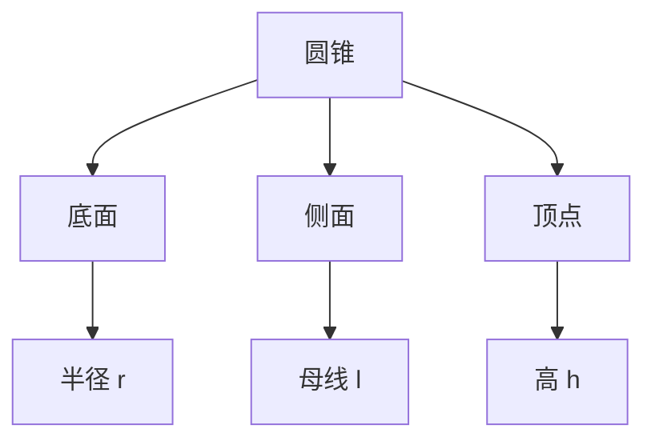

---
{"dg-publish":true,"permalink":"/02/////","tags":["数学/几何/圆"]}
---

以下是关于**圆锥**的完整知识体系，涵盖定义、性质、公式推导与应用场景（附逻辑导图）：

---

### 🎯 一、核心定义与结构

1. ​**几何定义**​：
    - 直角三角形绕其一条直角边旋转一周形成的几何体。
    - ​**底面**​：圆形平面（半径 $r$）
    - ​**侧面**​：曲面（展开为扇形）
    - ​**顶点**​：旋转直角边的对角点
    - ​**高**​（$h$）：顶点到底面的垂直距离
    - ​**母线**​（$l$）：顶点到底面圆周上任意点的线段

2. ​**关键关系**​：
    
    $$
    \boxed{l = \sqrt{r^2 + h^2}} \quad \text{(勾股定理)}
    $$
    

---

### 📐 二、公式体系与推导

#### ​**​(1) 侧面积 $S_{\text{侧}}$​**​

- ​**公式**​： $S_{\text{侧}} = \pi r l$
- ​**推导**​：侧面展开为**扇形**​ → 弧长 = 底面周长 $2\pi r$，半径 = 母线长 $l$
    
    $$
    S_{\text{侧}} = \frac{1}{2} \times \text{弧长} \times \text{半径} = \frac{1}{2} \times 2\pi r \times l = \pi r l
    $$
    

#### ​**​(2) 底面积 $S_{\text{底}}$​**​

- ​**公式**​： $S_{\text{底}} = \pi r^2$

#### ​**​(3) 表面积 $S_{\text{表}}$​**​

- ​**公式**​： $S_{\text{表}} = S_{\text{侧}} + S_{\text{底}} = \pi r l + \pi r^2 = \pi r (l + r)$

#### ​**​(4) 体积 $V$​**​

- ​**公式**​： $V = \frac{1}{3} \pi r^2 h$
- ​**推导**​：
    - ​**实验法**​：用圆锥容器装水倒入等底等高的圆柱，需3次装满 → $V_{\text{锥}} = \frac{1}{3} V_{\text{柱}}$
    - ​**积分法**​：沿高度方向切片积分 → $V = \int_0^h \pi \left(r \frac{x}{h}\right)^2 dx = \frac{1}{3} \pi r^2 h$

---

### 🔍 三、展开图与截面特性

1. ​**侧面展开图**​：
    
    - ​**扇形**​（圆心角 $\theta = \frac{360^\circ \cdot r}{l}$）
    - 弧长 = $2\pi r$，半径 = $l$
2. ​**截面性质**​：
    
|截面方向|形状|条件|
|---|---|---|
|平行于底面|圆（半径按比例缩小）|半径比 = $\frac{\text{距顶点距离}}{h} \times r$|
|过顶点且垂直底面|等腰三角形（底=$2r$，腰=$l$）|对称轴为圆锥高|
|过顶点倾斜截面|椭圆或抛物线|角度不同形状不同|
    

---

### ⚙️ 四、实际应用场景

1. ​**工程与设计**​：
    
    - 圆锥形帐篷/屋顶 → 利用侧面积公式计算材料用量
    - 沙堆/粮堆体积估算 → $V = \frac{1}{3} \pi r^2 h$（结合堆积角修正）
2. ​**物理模型**​：
    
    - 圆锥摆运动 → 分析向心力与摆角关系
    - 流体从锥形容器流出 → 流速与液面高度关联（托里拆利定律）
3. ​**光学特性**​：
    
    - 圆锥曲面反射 → 用于聚光灯、卫星天线设计

---

### ⚠️ 五、易错点与解题技巧

1. ​**混淆母线 $l$ 与高 $h$​**​：
    
    - 计算侧面积必须用 ​**母线长 $l$​**​（非高 $h$）→ $S_{\text{侧}} = \pi r l$
2. ​**体积公式条件**​：
    
    - $V = \frac{1}{3} \pi r^2 h$ 仅适用于**直圆锥**​（顶点投影在底面圆心）
3. ​**展开图圆心角计算**​：
    
    $$
    \theta = \frac{r}{l} \times 360^\circ \quad \text{（需比例换算）}
    $$
    
    - 例：若 $l = 2r$，则 $\theta = \frac{r}{2r} \times 360^\circ = 180^\circ$

---

### 🔄 六、与相似几何体的关联

1. ​**圆台**​：圆锥截去顶部小圆锥 →
    
    $$
    V_{\text{台}} = \frac{1}{3} \pi h (R^2 + Rr + r^2) \quad (R, r \text{为上下底半径})
    $$
    
2. ​**圆锥曲线**​：
    - 平面截圆锥 → 圆/椭圆/抛物线/双曲线（取决于倾角）

---

​**总结**​：圆锥的核心是 ​**​“扇形侧面”+“三角形截面”​**​ 的结构特征。掌握母线 $l$、半径 $r$、高 $h$ 的勾股关系（$l^2 = r^2 + h^2$），可打通侧面积、展开图与空间计算的关键链！建议用纸片制作圆锥模型，直观理解展开与折叠的几何变换。