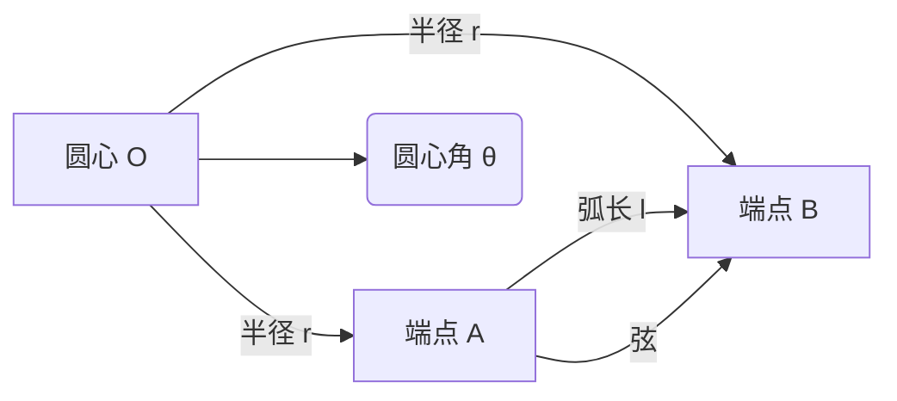

---
{"dg-publish":true,"permalink":"/02/////","tags":["数学/几何/圆"]}
---

以下是关于「**扇形**」的核心知识提炼（含公式推导与场景应用）：

---

### 🧩 一、定义与组成

1. ​**本质**​：圆中两条半径 + 一条弧围成的**封闭图形**。
2. ​**关键要素**​：
    - ​**圆心角**​（θ）：两半径的夹角（单位：度° 或 弧度 rad）
    - ​**弧长**​（l）：扇形边界曲线的长度
    - ​**弦**​：连接两半径端点的线段（图中 AB）
    - ​**半径**​（r）：圆的半径

---

### 📐 二、核心公式（附推导逻辑）

|​**公式**​|​**表达式**​|​**推导说明**​|
|---|---|---|
|​**弧长公式**​|$l = \frac{\theta}{360^\circ} \cdot 2\pi r$|圆心角占圆周角比例 × 圆周长|
||$l = \theta \cdot r$|​**弧度制下**​（θ 单位为 rad）|
|​**面积公式**​|$S = \frac{\theta}{360^\circ} \cdot \pi r^2$|圆心角比例 × 圆面积|
||$S = \frac{1}{2} \theta r^2$|弧度制推导（由 $\frac{1}{2}lr$ 代入弧长公式）|
|​**弦长公式**​|$c = 2r \sin\left(\frac{\theta}{2}\right)$|等腰三角形 + 正弦定理|
|​**周长公式**​|$P = l + 2r$|​**弧长 + 两条半径**​|

#### 💡 关键推导：面积公式的两种理解

1. ​**比例法**​：扇形面积 = $\frac{\theta}{360^\circ} \times \pi r^2$
2. ​**积分思想**​：将扇形分割为小三角形，极限求和 → $S = \frac{1}{2} l r = \frac{1}{2} (\theta r) r = \frac{1}{2} \theta r^2$（弧度制）

---

### 🔢 三、角度与弧度转换

1. ​**转换关系**​：
    
    $$
    \boxed{1 \ rad = \frac{180^\circ}{\pi} \approx 57.3^\circ}, \quad \boxed{1^\circ = \frac{\pi}{180} \ rad}
    $$
    
2. ​**常用弧度**​：
    
|角度|30°|45°|60°|90°|180°|
|---|---|---|---|---|---|
|弧度|$\frac{\pi}{6}$|$\frac{\pi}{4}$|$\frac{\pi}{3}$|$\frac{\pi}{2}$|$\pi$|
    

---

### ⚙️ 四、弓形与变式问题

1. ​**弓形面积**​：扇形面积 - 三角形面积
    
    $$
    S_{\text{弓}} = S_{\text{扇}} - S_{\triangle} = \frac{1}{2} r^2 (\theta - \sin\theta) \quad (\text{弧度制})
    $$
    
    - $\theta$ 为弧度，$\sin\theta$ 需用弧度值计算。
2. ​**缺角扇形**​：  
    面积 = 大扇形面积 - 小扇形面积  
    周长 = 大弧 + 小弧 + 2×(半径差)
    

---

### 📊 五、典型应用场景

1. ​**几何设计**​：
    - 钟表刻度（30°扇形区）、披萨切割（圆心角相等）
2. ​**物理建模**​：
    - 旋转体扫过的角度 → 计算轨迹弧长（如齿轮转动）
3. ​**工程计算**​：
    - 扇形钢板下料（面积计算）、管道弯头展开图（弧长 ≈ 展开长度）
4. ​**数据可视化**​：
    - 饼状图中扇区占比 = 数据百分比 = $\frac{\theta}{360^\circ}$

---

### ⚠️ 易错点

1. ​**单位混淆**​：
    - 角度制 vs 弧度制（公式需统一单位！）
    - 例：用 $S = \frac{1}{2}\theta r^2$ 时，$\theta$ 必须为弧度。
2. ​**弓形面积**​：
    - 当 $\theta > 180^\circ$ 时，弓形为 ​**劣弧 + 弦**，需用 $S_{\text{圆}} - S_{\text{扇}} + S_{\triangle}$。

---

掌握扇形公式的**几何本质**​（比例思想+三角形分解）即可灵活应对计算与变形问题！建议通过画图理解弧长/面积的积分推导，深化数学直觉。 🚀